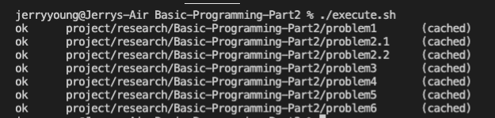

# Tatacara Melakukan Setup Tugas

clone project ini dengan cara

```
git clone https://github.com/Immersive-Backend-Resource/Algorithm-Data-Structure-Part1.git
```

setelah clone selesai, jalankan perintah `cd Algorithm-Data-Structure-Part1` -->  **HAL INI DILAKUKAN 1x saja**

Setelah pindah folder, lakukan perintah dibawah ini secara berurutan :

```
rm -rf .git
chmod 777 ./execute.sh
```

setelah menjalankan perintah diatas, lakukan inisialisasi ulang untuk git dengan 

```
git init
```

buat repository pada github organization kalian dengan format: `Algorithm-Data-Structure-Part1`

lalu tambahkan remote url
```
git remote add origin url-repository-kalian
```

## Tatacara Mengerjakan Tugas

1. Lengkapi function yang sudah disediakan
2. **DILARANG MENGUBAH TIPE DATA HASIL RETURN**
3. Untuk melakukan run program setiap soal lakukan seperti contoh(sesuaikan keperluan): 
    ```
    go run ./problem1/problem1.go
    ```
4. Setelah semua program selesai dikerjakan, jalankan
    ```
    ./execute.sh
    ```
5. Screenshoot terminal hasil perintah nomor 4.


6. Push project ini dan hasil screenshoot ke repo yang telah dibuat pada github organization.
7. Selamat Mengerjakan!!! :grin: